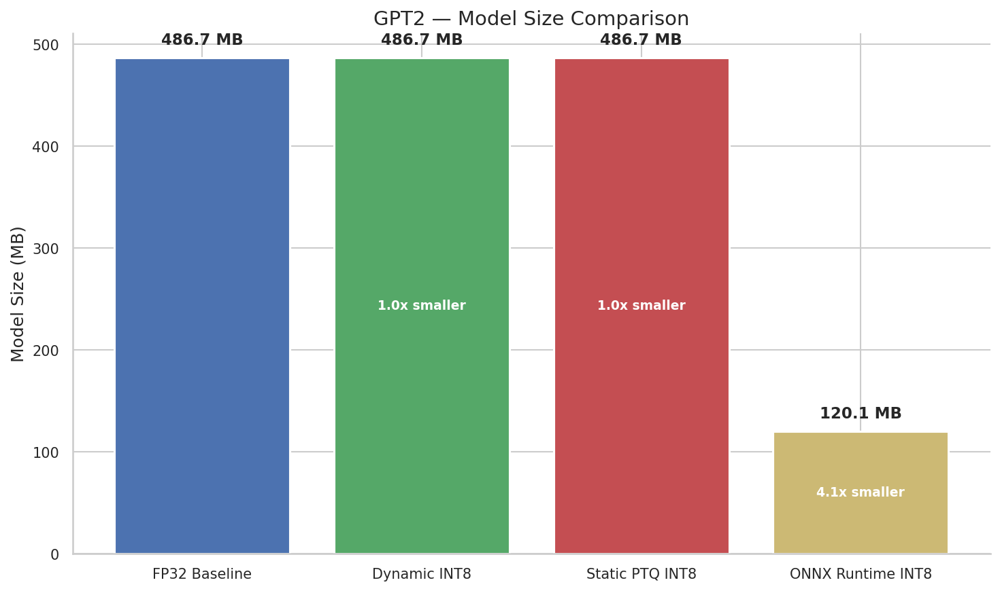
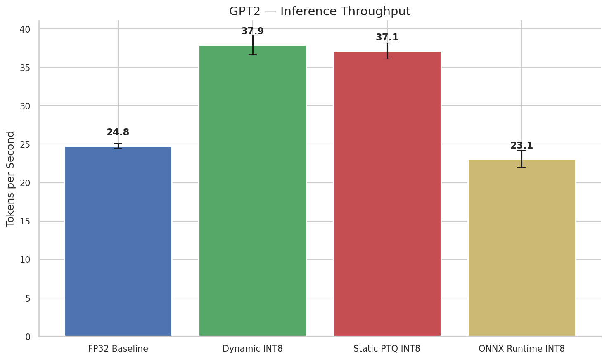
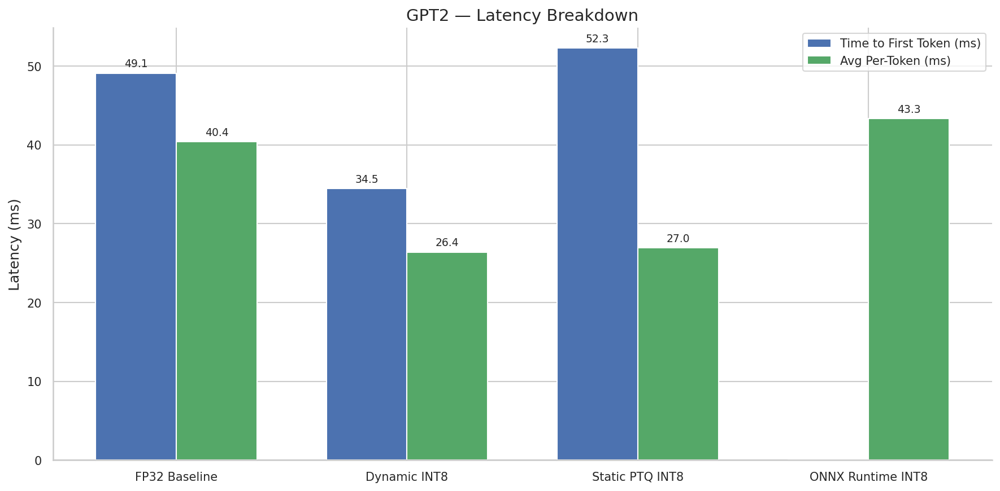
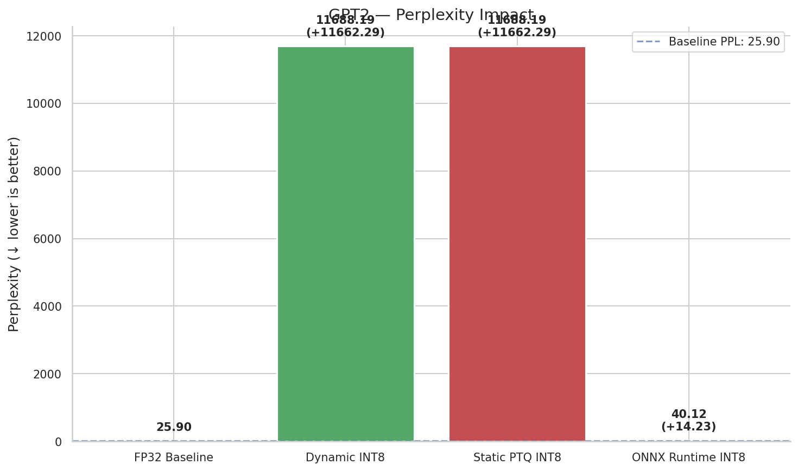
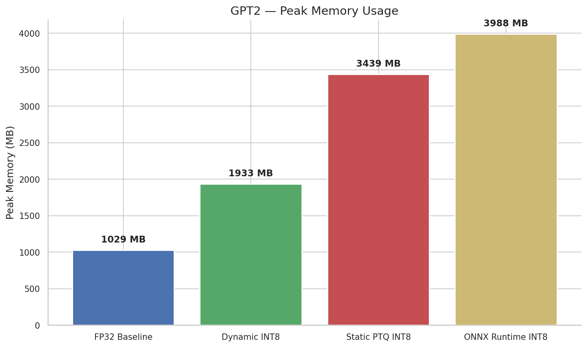
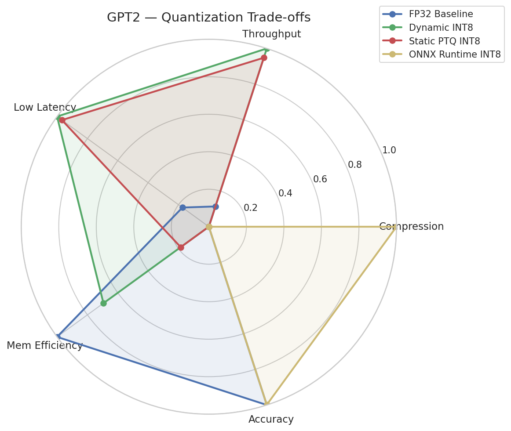

# QuantBench Results: GPT2

## Comparison Table

| Method            | Precision      |   Model Size (MB) | Compression   | Throughput (tok/s)   |   TTFT (ms) |   Per-Token (ms) |   Peak Mem (MB) |   Perplexity |
|-------------------|----------------|-------------------|---------------|----------------------|-------------|------------------|-----------------|--------------|
| FP32 Baseline     | FP32           |             486.7 | 1.00x         | 24.8 ± 0.3           |        49.1 |             40.4 |            1029 |        25.9  |
| Dynamic INT8      | INT8 (dynamic) |             486.7 | 1.00x         | 37.9 ± 1.3           |        34.5 |             26.4 |            1933 |     11688.2  |
| Static PTQ INT8   | INT8 (static)  |             486.7 | 1.00x         | 37.1 ± 1.1           |        52.3 |             27   |            3439 |     11688.2  |
| ONNX Runtime INT8 | INT8 (ONNX)    |             120.1 | 4.05x         | 23.1 ± 1.1           |         0   |             43.3 |            3988 |        40.12 |


## Model Size Comparison



## Inference Throughput



## Latency Breakdown



## Perplexity Impact



## Peak Memory Usage



## Trade-off Radar




## Generated Text Samples

### FP32 Baseline

```
 uncertain.

"We're not sure what the future of artificial intelligence on edge devices will be," said Dr. Michael S. Schoenfeld, a professor of computer science at the University of California, Berkeley. "We're not sure what the future of artificial intelligence on edge devices will be."

The researchers say that the future of artificial intelligence on edge devices is uncertain.

"We're not sure what the future of artificial intelligence on edge devices will be," said Dr.
```

### Dynamic INT8

```
 abundantly clear. Newly-caught and the "crowd-sourced, the-sucking-on-the-sleeve" the "crowd-sourced, the-sucking-on-the" the "cormalization" and "crowd-sourcing" the "crowd-sourcing" the "crowd-sourcing" the "crowd-s"," and the "crowd-sourcing" the "crowd-sourcing" the
```

### Static PTQ INT8

```
 abundantly clear. Newly-caught and the "crowd-sourced, the-sucking-on-the-sleeve" the "crowd-sourced, the-sucking-on-the" the "cormalization" and "crowd-sourcing" the "crowd-sourcing" the "crowd-sourcing" the "crowd-s"," and the "crowd-sourcing" the "crowd-sourcing" the
```

### ONNX Runtime INT8

```
 uncertain.

"We're not sure what the future of artificial intelligence on edge devices is," said Dr. Michael S. Schoenfeld, a professor of computer science at the University of California, Berkeley. "But we're certainly not at the point where we're going to be able to predict what the future of artificial intelligence on edge devices is."

The researchers say that the future of artificial intelligence on edge devices is uncertain.

"We're not sure what the future of
```
