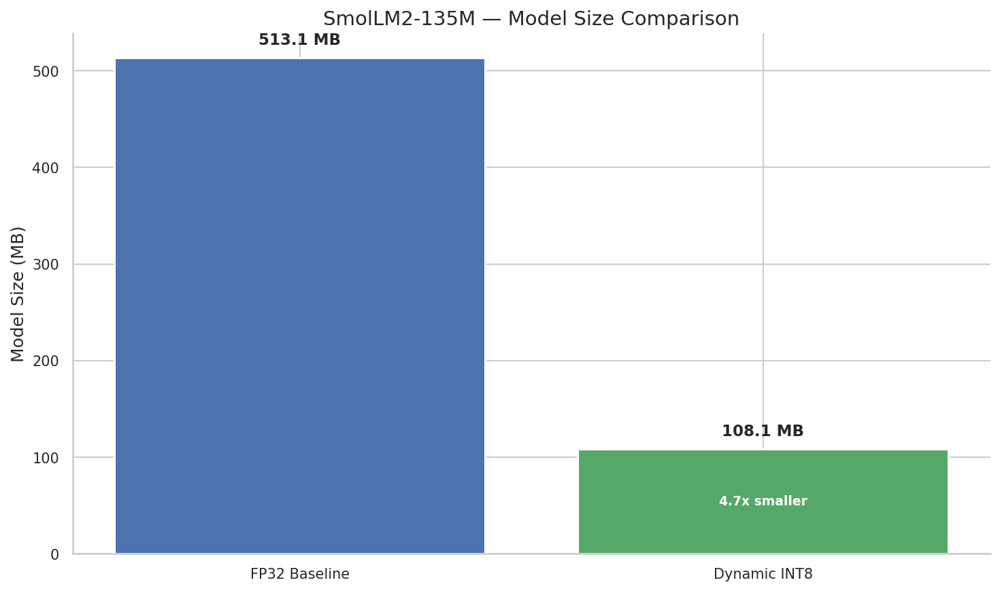
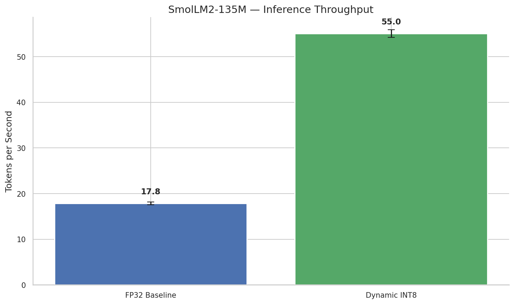
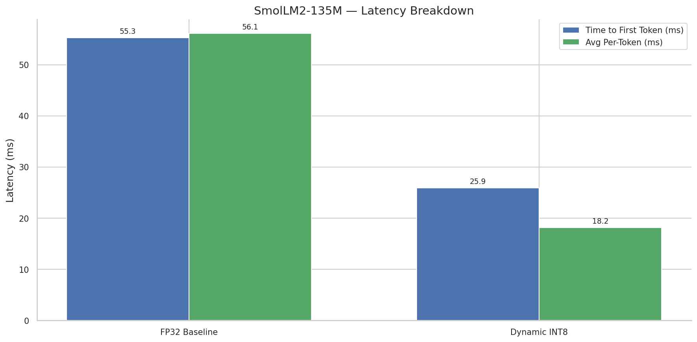
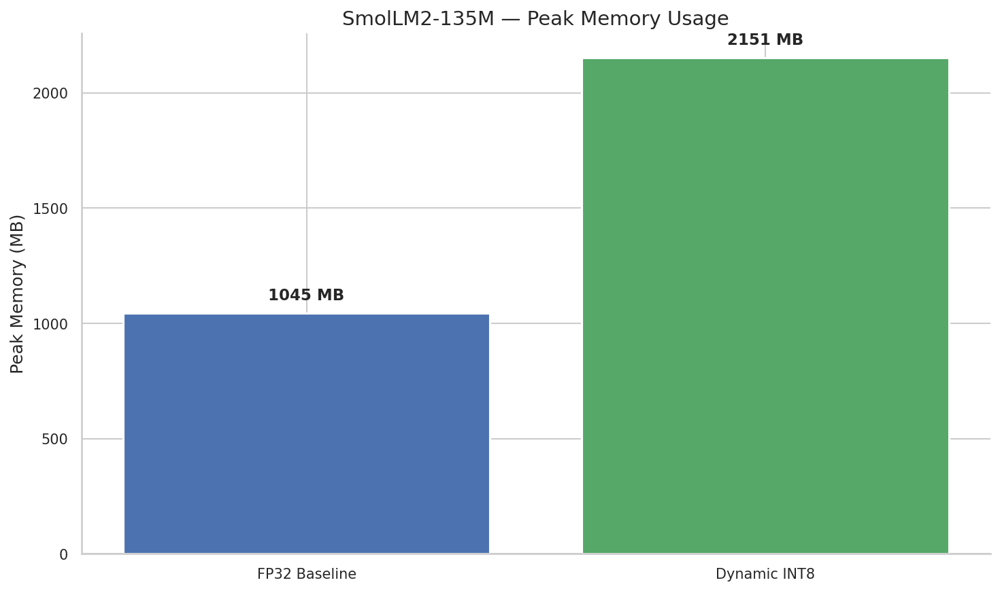
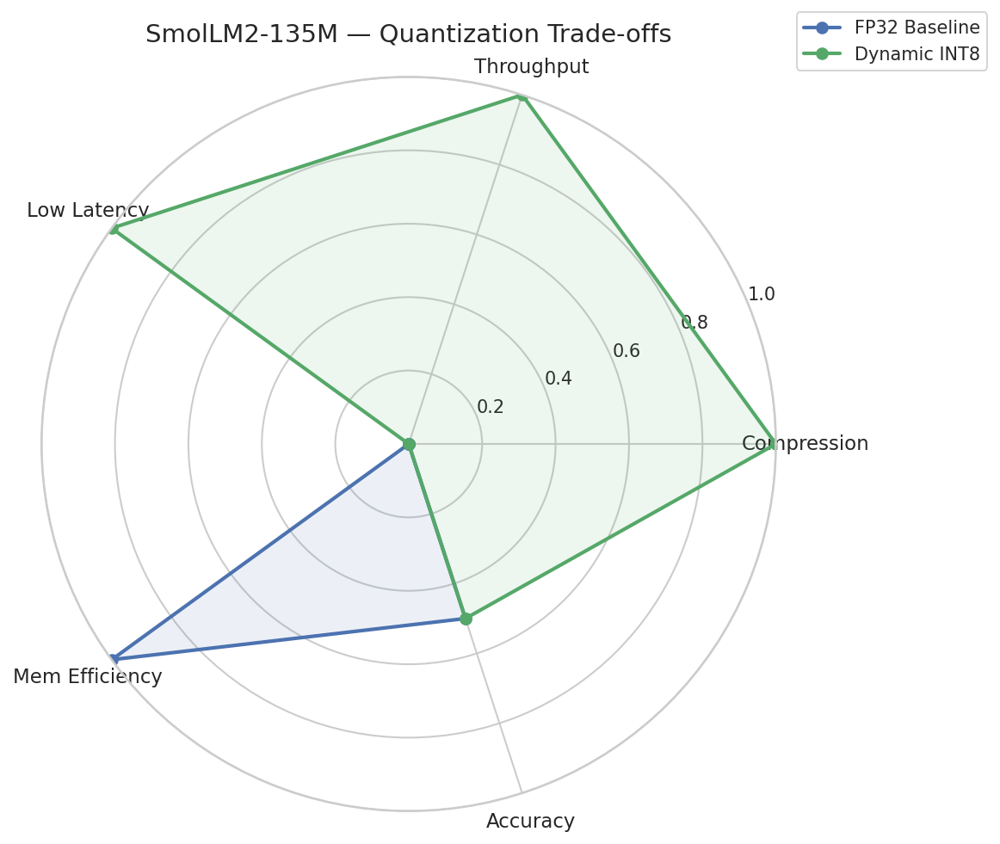

# QuantBench Results: SmolLM2-135M

## Comparison Table

| Method        | Precision      |   Model Size (MB) | Compression   | Throughput (tok/s)   |   TTFT (ms) |   Per-Token (ms) |   Peak Mem (MB) | Perplexity   |
|---------------|----------------|-------------------|---------------|----------------------|-------------|------------------|-----------------|--------------|
| FP32 Baseline | FP32           |             513.1 | 1.00x         | 17.8 ± 0.3           |        55.3 |             56.1 |            1045 | —            |
| Dynamic INT8  | INT8 (dynamic) |             108.1 | 4.75x         | 55.0 ± 0.8           |        25.9 |             18.2 |            2151 | —            |


## Model Size Comparison



## Inference Throughput



## Latency Breakdown



## Perplexity Impact


## Peak Memory Usage



## Trade-off Radar




## Generated Text Samples

### FP32 Baseline

```
 a matter of debate.

The future of artificial intelligence on edge devices is a matter of debate.

Artificial intelligence (AI) is a field of study that aims to create machines that can think and learn like humans.

AI is a field of study that is growing in popularity, and it is expected to become a major part of our lives in the future.

AI is a field that is growing in popularity, and it is expected to become a major part of our lives
```

### Dynamic INT8

```
 likely to be a very different kind of device from the ones we’ve been using for years.

The first step is to make sure that the devices are designed to be resilient to the kinds of attacks that are likely to be used in the future.

The second step is to make sure that the devices are designed to be resilient to the kinds of attacks that are likely to be used in the future.

The third step is to make sure that the devices are designed to be
```
